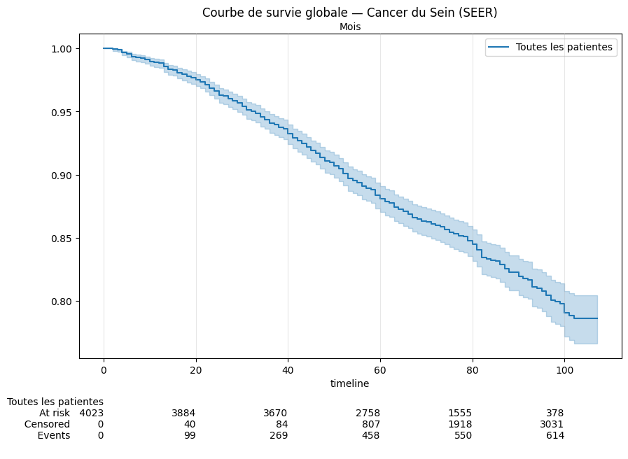
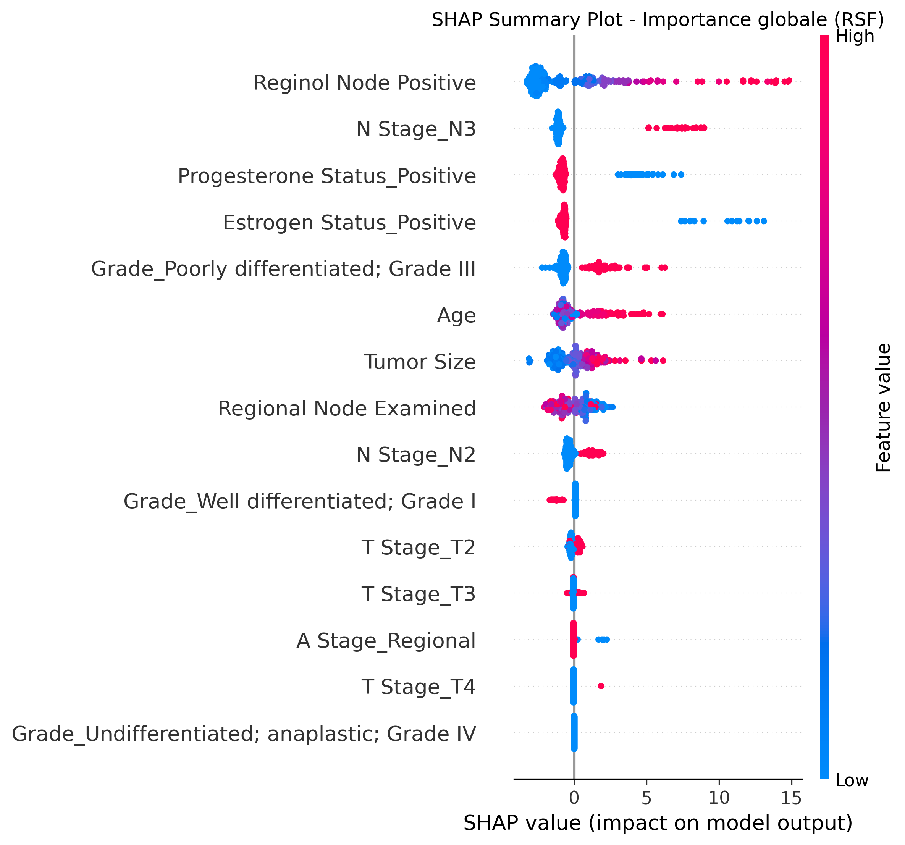

# breast-cancer-survival-analysis-seer

Projet de survival analysis sur le cancer du sein a partir du dataset SEER, avec prise en compte explicite de la censure et comparaison de plusieurs approches de modelisation.

## Contexte

L'objectif est de predire le risque dans le temps pour des patientes atteintes d'un cancer du sein.
Ce probleme est formule en **survival analysis** (time-to-event) et non en classification binaire.

Variables cibles:
- `Survival Months` : duree observee
- `Status` : evenement (`Dead` = 1, sinon censure = 0)

## Dataset

- Source: `seer_cancer.csv`
- Population: patientes avec variables cliniques et tumorales
- Type de donnees: numeriques + categorielles
- Particularite: presence de censure (evenement non observe pour une partie des patientes)

## Methodes

Le notebook `survival_analysis.ipynb` inclut:
- EDA et visualisations de survie (Kaplan-Meier)
- Baseline clinique
- Cox Proportional Hazards
- Cox stratifie
- Random Survival Forest (RSF)
- Interpretation des predictions avec SHAP

## Resultats

Metrique principale: **C-index**

Comparaison des principaux modeles:
- RSF (valide): **C-index = 0.720**, **IBS = 0.054**
- Cox sans stratification: **C-index = 0.723**, **IBS = 0.052** (mais hypothese PH violee)
- Cox stratifie: **C-index = 0.696**
- Baseline (T Stage): **C-index = 0.600**

### Conclusion du modele retenu

Parmi les modeles statistiquement valides, le RSF obtient le meilleur C-index (0.720) et une excellente calibration (IBS = 0.054). Le Cox sans stratification presente des metriques legerement superieures (C-index = 0.723, IBS = 0.052) mais viole l'hypothese des risques proportionnels pour 3 variables, il ne peut donc pas etre retenu comme modele principal.

Le RSF est retenu pour le deploiement en raison de son meilleur pouvoir discriminant parmi les modeles valides, de sa calibration excellente, et de sa compatibilite avec l'interpretabilite SHAP pour l'explication individuelle par patiente.

## Visualisations

### Courbe Kaplan-Meier



### Explication SHAP (RSF)



## Demo

- Demo locale: `http://127.0.0.1:7860`
- Demo en ligne: non disponible pour le moment (application pas encore deployee)

## Lancement local

```bash
pip install -r requirements.txt
python gradio_app.py
```

## Deploiement rapide (Hugging Face Spaces)

1. Creer un Space Gradio.
2. Ajouter ces fichiers:
	- `gradio_app.py`
	- `requirements.txt`
	- `seer_cancer.csv`
	- `images/`
3. Lancer l'application.

## Note

Le formulaire Gradio est volontairement compact. Certaines variables non saisies sont initialisees automatiquement avec des valeurs de reference de la cohorte d'entrainement.
