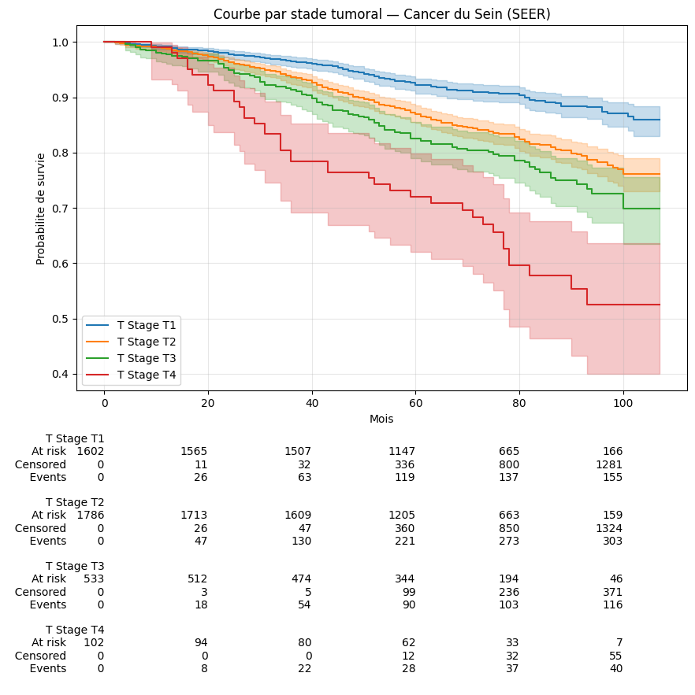
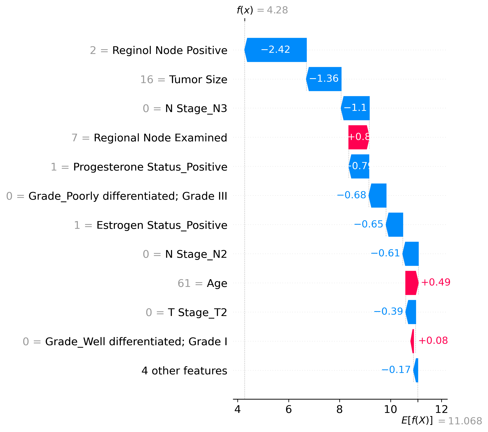

# Breast Cancer Survival Analysis — SEER Dataset

Survival analysis framework for breast cancer prognosis using machine learning.
Comparison of four models with SHAP-based interpretability and a Gradio deployment interface.

---

## Dataset
The dataset used in this project is publicly available on Kaggle:
[SEER Breast Cancer Data](https://www.kaggle.com/datasets/reihanenamdari/breast-cancer)

Download the CSV and rename it `seer_cancer.csv` before running the notebook.

- **Size:** 4,023 patients after preprocessing
- **Target:** `Survival Months` (duration) + `Status` (event: Dead=1, Censored=0)


---

## Models

| Model | C-Index | IBS | Valid |
|---|---|---|---|
| Cox Naive — T Stage only (baseline) | 0.611 | 0.058 | ✓ |
| Cox PH (stratified) | 0.700 | 0.065 | ✓ |
| **Random Survival Forest ← selected** | **0.720** | **0.054** | **✓** |
| Cox PH (no stratification) | 0.723 | 0.052 | ✗ PH violated |

The RSF is selected as the primary model — best C-index among statistically valid models and compatible with SHAP interpretability.

---

## Key Results

**5-year survival by subgroup (Kaplan-Meier):**

- T Stage: T1 → 92.2% vs T4 → 72.0%
- Grade: Grade I → 95.0% vs Grade IV → 62.7%
- Estrogen Status: Positive → 89.9% vs Negative → 63.4%

**Top 3 SHAP predictors:**

1. Reginol Node Positive (MeanAbsSHAP = 2.92)
2. N Stage N3 (MeanAbsSHAP = 1.88)
3. Progesterone Status Positive (MeanAbsSHAP = 1.36)

---

## Visualizations

### Kaplan-Meier — global survival curve


### Kaplan-Meier — by T Stage


### SHAP summary plot (RSF)


### SHAP waterfall — individual patient


---

## Project Structure

```
Survival-Analysis-Oncologie/
├── survival_analysis.ipynb    ← main notebook
├── gradio_app.py              ← Gradio app (local + HF Spaces)
├── requirements.txt
├── seer_cancer.csv
├── shap_global_importance_rsf.csv
└── images/
```

---

## Run Locally

```bash
pip install -r requirements.txt
python gradio_app.py
```

App available at `http://127.0.0.1:7860`

---

## Try the app

🔗 [Try the app on Hugging Face Spaces](https://huggingface.co/spaces/larissa-data/breast-cancer-survival)


---

## Stack

Python · Lifelines · Scikit-survival · SHAP · Gradio · Pandas · Matplotlib